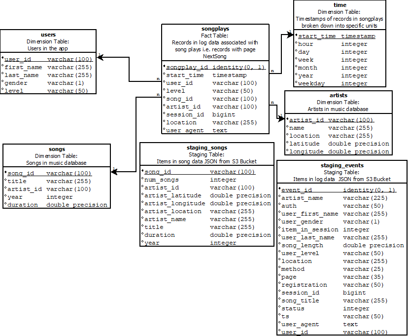

# Project 3: Song Play Analysis With S3 and Redshift

## Summary
* [Preamble](#Preamble)
* [Schema definition](#Schema-definition)
* [ETL process](#ETL-process)
* [How to run](#How-to-run)
* [Project structure](#Project-structure)
--------------------------------------------

#### Preamble

In this project we are going to use two Amazon Web Services,
[S3](https://aws.amazon.com/en/s3/) (Data storage)  
and [Redshift](https://aws.amazon.com/en/redshift/) (Data warehouse with ``columnar storage``)

Data sources are provided by two public ``S3 buckets``. One bucket contains  
info about songs and artists, the second has info concerning actions done   by users (which song are listening, etc.. ). The objects  contained in both buckets   are JSON files. The song bucket has all
the files under the same directory but   the event ones don't,
so we need a descriptor file (also a JSON) in order to extract   data from the folders by path. We used a descriptor file because we don't have a common prefix on folders

The Redshift service is where data will be ingested and transformed,  
in fact though COPY command we will access to the JSON files inside  
the buckets and copy their content on our staging tables

--------------------------------------------

#### Schema definition
This is the schema of the database

How to read the schema:
* Blank bullets are used to identify the fields that can be null  
* Black bullets are used to identify the fields that can not be null  
* If the field is underlined means that is a primary key  

To represent this context a ``Star schema`` has been used  

The songplays table is the core of this schema, is it our fact table and  
it contains foreign keys to four tables;
* start_time REFERENCES time(start_time)
* user_id REFERENCES time(start_time)
* song_id REFERENCES songs(song_id)
* artist_id REFERENCES artists(artist_id)

There are also two staging tables; One for song dataset and one for  
and one for event dataset

--------------------------------------------

#### ETL process

In this project most of ETL is done with SQL (Python used just as bridge), transformation and data normalization is done by Query, check out the ``sql_queries`` python module

--------------------------------------------

#### How to run
Although the data-sources are provided by two [``S3 buckets``](https://aws.amazon.com/en/s3/) the only thing you need for running the example is an [``AWS Redshift Cluster``](https://aws.amazon.com/en/redshift/) up and running

And of course [Python](https://www.python.org/downloads/)  

<b> Notes: </b>
* In this example a Redshift ``dc2.large``  cluster with <b> 4 nodes </b> has been created, with a cost of ``USD 0.25/h (on-demand option)`` per cluster
* In this example we will use [``IAM role ``](https://docs.aws.amazon.com/en_us/IAM/latest/UserGuide/id_roles.html) authorization mechanism, the only policy attached to this IAM will be am [``AmazonS3ReadOnlyAccess``](https://aws.amazon.com/en/blogs/security/organize-your-permissions-by-using-separate-managed-policies/)

After opening terminal session, set your filesystem on project root folder  
and  insert these commands in order to run the demo:   
<I> This will create our tables, this must be runned first </I>  
`` python create_tables.py``  

<I> And this will execute our ETL process </I>  
`` python etl.py``  

--------------------------------------------

#### Project structure
This is the project structure, if the bullet contains ``/``  
means that the resource is a folder:

* <b> /img </b> - Simply a folder with images that are used in this ``md``
* <b> create_tables.py </b> - This script will drop old tables (if exist) ad re-create new tables
* <b> etl.py </b> - This script executes the queries that extract JSON data
from the S3 bucket and ingest them to Redshift
* <b> sql_queries.py </b> - This file contains variables with SQL statement in String formats,  partitioned by CREATE, DROP, COPY and INSERT statements
* <b> dhw.cfg </b> - Configuration file used that contains info about Redshift, IAM and S3

--------------------------------------------
